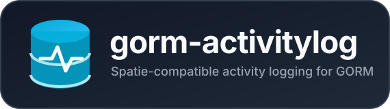

<p align="center">
  
</p>

<p align="center">
  
</p>

<p align="center">
  Automatic and manual activity logging for GORM, with a `activity_log` schema compatible with Spatie Laravel Activitylog.
</p>

<p align="center">
  <a href="https://github.com/noormaulida/gorm-activitylog/actions/workflows/go.yml">
    
  </a>
  <a href="https://codecov.io/gh/noormaulida/gorm-activitylog">
    
  </a>
  <a href="https://pkg.go.dev/github.com/noormaulida/gorm-activitylog">
    
  </a>
  <a href="https://github.com/noormaulida/gorm-activitylog/blob/main/LICENSE">
    
  </a>
</p>

## Installation

```bash
go get github.com/noormaulida/gorm-activitylog@latest
```

## Setup

Register the callbacks once after opening the GORM connection:

```go
db, err := gorm.Open(mysql.Open(dsn), &gorm.Config{})
if err != nil {
    return err
}

if err := activitylog.Migrate(db); err != nil {
    return err
}
if err := activitylog.Register(db); err != nil {
    return err
}
```

`Migrate` is optional when the application already uses Spatie's migration.

## Automatic model logging

Implement `ActivityLogOptions` on each model that should be audited:

```go
type Article struct {
    ID        uint64
    Title     string
    Body      string
    Secret    string
    CreatedAt time.Time
    UpdatedAt time.Time
}

func (*Article) ActivityLogOptions() activitylog.LogOptions {
    return activitylog.LogOptions{
        LogName:          "articles",
        SubjectType:      "App\\Models\\Article",
        IgnoreAttributes: []string{"secret", "updated_at"},
        LogOnlyDirty:     true,
    }
}
```

Normal GORM operations then create `created`, `updated`, and `deleted` activities:

```go
db.Create(&article)
db.Save(&article)
db.Delete(&article)
```

`LogAttributes` is an optional whitelist. `IgnoreAttributes` is always applied after it and therefore takes precedence. Both Go field names and database column names are accepted.

Set `SubjectType` to the Laravel morph class or morph-map alias when sharing a database. If omitted, the GORM table name is used.

## Causer from request context

Put the authenticated user into a standard Go context and pass that context to GORM:

```go
ctx := activitylog.WithCauser(
    request.Context(),
    authenticatedUser.ID,
    "App\\Models\\User",
)

if err := db.WithContext(ctx).Create(&article).Error; err != nil {
    return err
}
```

Gin middleware can attach the causer to the request context:

```go
func ActivityContext() gin.HandlerFunc {
    return func(c *gin.Context) {
        userID := c.GetUint64("user_id")
        ctx := activitylog.WithCauser(
            c.Request.Context(),
            userID,
            "App\\Models\\User",
        )
        c.Request = c.Request.WithContext(ctx)
        c.Next()
    }
}

// In a handler:
db.WithContext(c.Request.Context()).Create(&article)
```

Fiber v2 provides `UserContext` for the same purpose:

```go
func ActivityContext(c *fiber.Ctx) error {
    if userID, ok := c.Locals("user_id").(uint64); ok {
        ctx := activitylog.WithCauser(
            c.UserContext(),
            userID,
            "App\\Models\\User",
        )
        c.SetUserContext(ctx)
    }
    return c.Next()
}

// In a handler:
db.WithContext(c.UserContext()).Create(&article)
```

Apply this middleware after authentication so `user_id` is already available.

## Manual logging

Manual properties are stored directly in the `properties` JSON object:

```go
err := activitylog.New(db).
    UseLog("auth").
    Event("login").
    CausedBy(user.ID, "App\\Models\\User").
    WithProperties(map[string]any{
        "ip_address": request.RemoteAddr,
    }).
    Log("User logged in")
```

Use `PerformedOn(&article)` to attach a model subject. It reads the primary key and uses `SubjectType` from the model's `LogOptions`.

## Transaction behavior

Automatic activities are inserted through the same database transaction as the model operation. Rolling back the model change also rolls back its activity. Failure to serialize or insert an activity is returned as a GORM operation
error.

## Current limitations

- Automatic subjects require exactly one non-zero numeric primary key.
- UUID/ULID and composite primary keys are not currently supported.
- Instance-based operations such as `Create`, `Save`, `Update`, and `Delete` are supported. Bulk updates/deletes and operations whose model is a map do not produce automatic per-record activities.
- `Activity` targets the modern Spatie columns, including `event` and `batch_uuid`; compare its schema with the exact Spatie migration version used by an existing application before running `Migrate`.

## Running Tests

```bash
go test -v ./...
```

## License

[MIT License](LICENSE)
